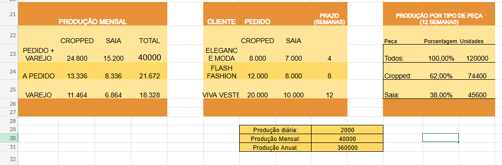
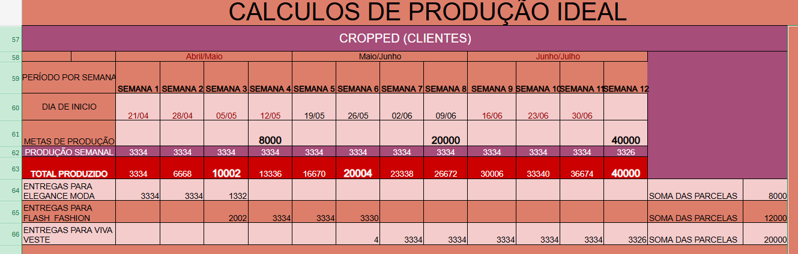
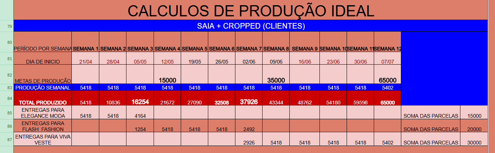
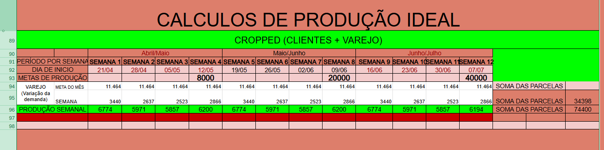
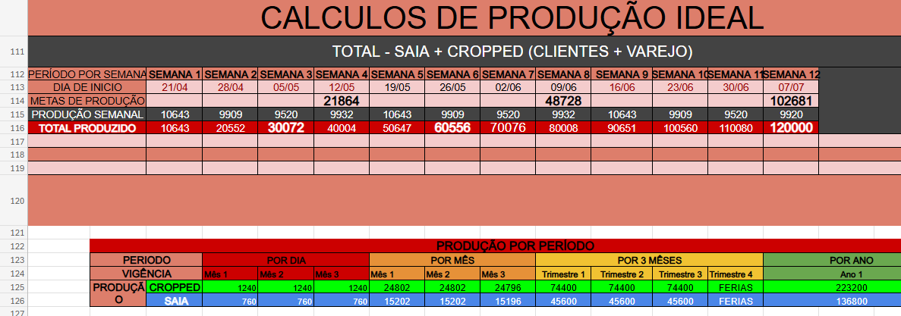

🚀 Sistema de Planejamento Produtivo com Simulação de Cenários (APSC)
📖 Descrição

Sistema automatizado desenvolvido para planejamento e controle da produção, com capacidade de simular diferentes cenários produtivos a partir de variáveis como demanda e capacidade operacional.

A ferramenta transforma pedidos de múltiplos clientes em um plano completo de produção, distribuindo volumes entre produtos, clientes e varejo, com geração automática de resultados em diferentes horizontes de tempo.

⚙️ Funcionalidades
📊 Cálculo automatizado da produção com base na capacidade produtiva mensal
👥 Distribuição da demanda entre até 3 clientes distintos
🧩 Alocação de produção entre múltiplos produtos
🏪 Cálculo de excedente destinado ao varejo
⏱️ Conversão automática de produção em:
Dias
Semanas
Meses
Trimestres
Anual
⚙️ Cálculo de horas máquina com base na capacidade produtiva
🔄 Simulação dinâmica de cenários com atualização instantânea
🧠 Lógica do Sistema

O sistema opera a partir de três etapas principais:

1. Entrada de dados

Capacidade de produção mensal
Demanda por cliente
Distribuição por produto

2. Processamento

Conversão de capacidade em diferentes períodos
Distribuição proporcional da produção
Subtração da demanda da capacidade disponível
Geração de excedente para varejo

3. Saída

Produção por cliente
Produção por produto
Produção por período
Capacidade utilizada
Horas máquina
📈 Diferencial

O principal diferencial do sistema é sua capacidade de simulação:

Qualquer alteração nas variáveis de entrada gera automaticamente um novo cenário completo de produção, permitindo análise imediata de impactos na operação.

🎯 Aplicações
Planejamento e Controle da Produção (PCP)
Apoio à tomada de decisão
Análise de capacidade produtiva
Simulação de cenários operacionais
Otimização de processos produtivos
🛠️ Tecnologias utilizadas
Microsoft Excel
Modelagem de dados
Lógica de cálculo automatizado
📌 Status do Projeto

✅ Concluído (versão funcional)
🔄 Possível evolução para integração com BI ou sistemas web

## 📸 Demonstração

Tudo começa inserindo o valor de sua Capacidade de Produção, este valor deve ser maior ou igual ao valor de sua demanda que são os valores dos pedidos e prazos em número de semanas de saias e croppeds de cada cliente.

Procurar uma demanda que você tem condições de suprir é essencial. Estas são as unicas variáveis necessárias para os calculos

Nosso calculo começa nas metas de produção, elas são o somatório de entregas que você irá produzir por mês (4 semanas) entregando por semana. 
Você sabera se seu planejamento é viável se o total produzido atingir meta antes que a semana da meta termine.
Como você pode notar, nesta logica você irá entregar os pedidos um cliente de cada vez, primeiro o de 4 semanas, depois o de 8 e por fim o de 12 semanas. Quando a meta de um cliente é batida, o excedente é automaticamente direcionado para o proximo cliente na fila.
A mesma lógica é aplicada às variáveis separadamente, que são:
Clientes = C
Varejo = V
    - Cropped(C)
    - Saia(C)
    - Cropped(C) + Saia(C)
    - Cropped(V)
    - Cropped(V) | Cropped(V)+Cropped(C)
    - Saia(V)
    - Saia(V) | Saia(V)+Saia(C)
    - Cropped(C)+Cropped(V)+Saia(C)+Saia(V)

